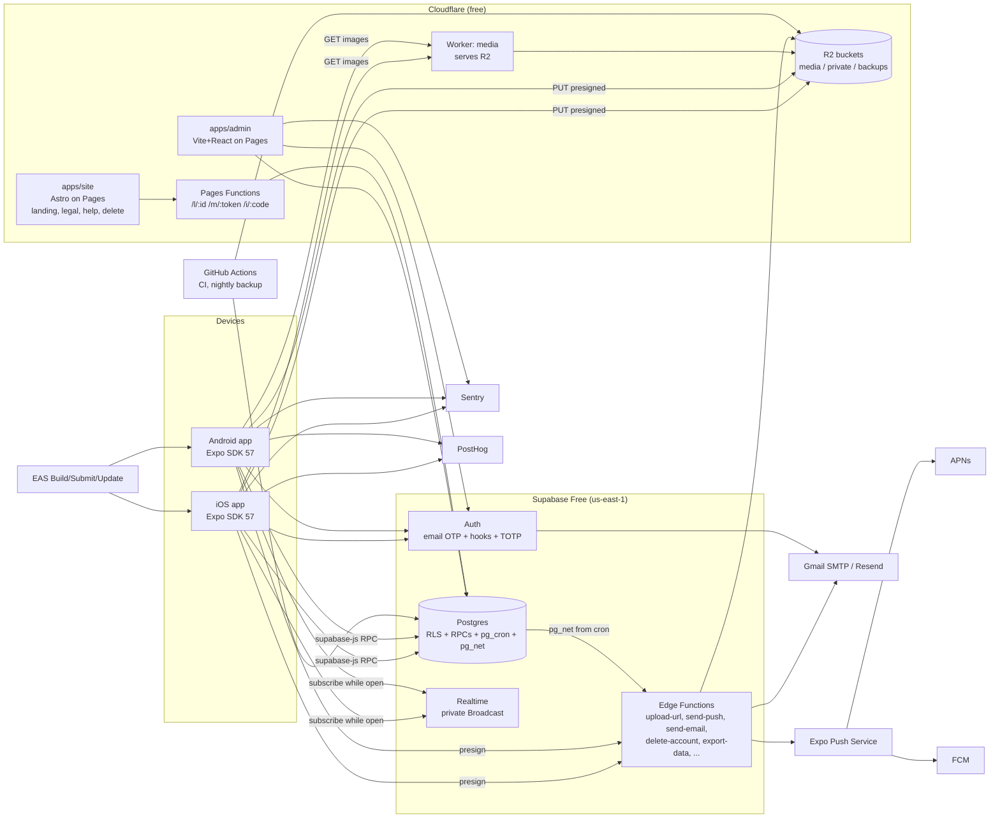

# ARCHITECTURE.md

## 1. System diagram

## 2. Data flow (key paths)

1. **Sign in.**
   - The app calls `lookup_school(domain)` → `auth.signInWithOtp` → the Auth hook `before_user_created` validates the domain → the code is emailed (SMTP).
   - `verifyOtp` → session. The `custom_access_token` hook adds claims → the `on_auth_user_created` trigger creates the profile.
2. **Discover.** `get_feed(cursor)` (RPC) → JSON rows → TanStack Query cache → deck. Images come from the media Worker and are cached on disk by expo-image. Swipes are batched through `record_swipes`.
3. **Sell.**
   - `reserve_listing_id` → process photos on device (resize, WebP, EXIF stripped) → the `upload-url` Edge Function presigns PUTs → direct PUT to R2.
   - `create_listing` (idempotent on id) → the trigger queues saved-search and wanted-match notifications.
4. **Offer → chat.**
   - `make_offer` → trigger → `notifications` row → cron → `send-push` → Expo → APNs/FCM.
   - `accept_offer` locks the listing, creates the chat with a snapshot, and auto-declines the others.
5. **Chat.** `send_message` (idempotent on `client_id`) → trigger → `realtime.broadcast_changes('chat:{id}')` → subscribed clients; offline recipients get a push.
6. **Meetups and deals.** `propose_meetup` / `confirm_meetup` / `checkin_meetup` → cron reminders → `deal_check` → `mark_sold` + `submit_rating`.
7. **Safety.** `create_report` (evidence snapshot) → admin queue → `admin_resolve_report` (audit log) → notification to the reporter.
8. **Account deletion.** The `delete-account` Edge Function:
   - moves evidence photos to private storage
   - deletes the user's R2 prefix
   - deletes the auth user; profile data cascades, deal rows are set to null and snapshots keep other people's chats intact
   - queues a confirmation email

## 3. Client/server boundary

| Concern | Client | Server |
|---|---|---|
| Validation | UX only (instant feedback) | **authoritative** (RPC + checks) |
| Business rules (offer states, limits, no-show, ratings reveal) | never | Postgres RPCs |
| Permissions | UI hides actions | RLS + RPC checks |
| Image processing | resize, WebP, EXIF strip, blurhash | size/type/owner via presign |
| Time | display in campus TZ | all logic in SQL with campus TZ |
| Secrets | only `EXPO_PUBLIC_*` | service key, R2 keys, SMTP, Expo token, peppers (Edge secrets / Vault) |
| Notifications | render, prefs UI | queue, prefs enforcement, caps, quiet hours |
| Anonymity (R1.1) | never receives author ids | aliases computed server-side |

## 4. State management

- **Server data:** TanStack Query only. Keys are `['feed', campusId]`, `['listing', id]`, `['inbox']`, `['chat', id]` and so on. Mutations use optimistic updates only for saves, swipes, votes and message send.
- **UI and ephemeral state:** Zustand stores (`useDeckStore`, `usePendingSwipes`, `useSheetStore`).
- **Persisted:**
  - **MMKV:** theme mode, coach flags, drafts, recent searches, pending swipes, query-cache persistence for feed page 1, inbox, my listings and profile.
  - **SecureStore:** the MMKV encryption key and auth session.
- **Realtime** is scoped to focused screens (the Chat screen and the Inbox tab). On `AppState` background → unsubscribe; on active → invalidate queries.

## 5. Offline behavior (ADR-006)

| Action | Offline behavior |
|---|---|
| Browse feed, listing, inbox, my listings | cached data + banner |
| Swipe / save | queued (MMKV, max 200), flushed on reconnect |
| Send message | queued in order while the app is running; failed state + retry after 30 s |
| Offer, listing, report, settings | blocked with `ERR_OFFLINE` copy |
| Sign in | blocked |

## 6. Free-tier budget (enforced by design)

| Resource | Limit | Design choice keeping us under | Alert at |
|---|---|---|---|
| Supabase DB | 500 MB | messages archived 90 d after the chat closes; swipes pruned 30 d; notifications 60 d; no raw events | 350 MB |
| Supabase egress | 5+5 GB | images never served from Supabase; small JSON; paginated | 3.5 GB |
| Realtime | 200 conns / 2M msgs | sockets only on Chat + Inbox while focused | 150 peak |
| Edge Functions | 500k/mo | cron push/email with exists-guard; batching | 300k |
| R2 | 10 GB, 1M A / 10M B | 2 sizes, WebP; sold > 180 d → thumbnail only | 7 GB |
| Workers | 100k req/day | long cache headers + client disk cache; domain (Q2) removes the cap | 70k/day |
| EAS | 15+15 builds/mo, 1k MAU updates | local builds as fallback; OTA only for fixes | 10 builds |
| PostHog | 1M events | 18 events, no autocapture | 600k |
| Sentry | 5k errors | sampling 5% traces; ignore network noise | 3.5k |
| GitHub Actions | 2,000 min | Linux only; DB tests only on `supabase/**` changes | 1,500 |
| Gmail SMTP (Plan A) | ~500/day | codes only at sign-up/re-verify; drip at 400/day | 350/day |

`scripts/usage-report.ts` (R1.0) emails a weekly report of these figures.

## 7. Architecture Decision Records

Each ADR lists its status, context, decision, consequences and the alternatives considered.

**ADR-001 Cross-platform framework: Expo SDK 57 (React Native 0.86, TypeScript)** — Accepted
- *Context:* solo developer; iOS + Android; heavy gesture/animation design; free builds.
- *Decision:* Expo managed with dev builds and CNG (prebuild).
- *Consequences:* EAS free tier; OTA updates; access to native modules through config plugins; no Expo Go.
- *Alternatives:* Flutter (a second language, no shared web tooling), native ×2 (double the work).

**ADR-002 Backend: Supabase (Postgres + RLS + RPC)** — Accepted
- *Decision:* all business rules live in SQL `security definer` RPCs; RLS on every table.
- *Consequences:* one place for rules, testable with pgTAP, portable Postgres (exit to self-host).
- *Alternatives:* Firebase (NoSQL rules harder for marketplace invariants; vendor lock), a custom Node API (hosting cost/ops).

**ADR-003 Media: Cloudflare R2 + Worker, client-side processing** — Accepted
- *Decision:* presigned PUTs; the device resizes, converts to WebP and strips EXIF; the Worker serves reads.
- *Consequences:* zero egress; no server image CPU; image quality is the client's responsibility.
- *Alternatives:* Supabase Storage (5 GB egress too small; transforms are paid).

**ADR-004 Realtime: Broadcast from the database on private channels, focus-scoped** — Accepted
- *Decision:* a trigger calls `realtime.broadcast_changes`; policies on `realtime.messages`.
- *Consequences:* stays under 200 connections; no Postgres Changes fan-out cost.
- *Alternatives:* Postgres Changes (per-row authorization cost), polling only (worse UX).

**ADR-005 Push: Expo Push Service driven by a DB outbox** — Accepted
- *Decision:* a `notifications` table is the outbox → cron → the `send-push` Edge Function.
- *Consequences:* one code path for prefs, caps and quiet hours; retries; dedupe.
- *Alternatives:* FCM/APNs direct (more credentials code), OneSignal (third-party data).

**ADR-006 Offline policy: read cache + queued swipes/messages only** — Accepted
- *Consequences:* simple conflict model; no offline writes for money-like actions (offers).

**ADR-007 State: TanStack Query (server) + Zustand (UI) + MMKV (persisted)** — Accepted
- *Alternatives:* Redux Toolkit (more boilerplate), Apollo (no GraphQL).

**ADR-008 Styling: Unistyles 3 with generated tokens; mode × single accent** — Accepted
- *Alternatives:* NativeWind (Tailwind look, weaker runtime theming), Tamagui (heavier).

**ADR-009 Web: Astro site + Vite admin on Cloudflare Pages** — Accepted
- *Context:* the site needs SEO and static legal pages; the admin is an authenticated SPA.
- *Alternatives:* Expo Router web export (heavy, weaker SEO), Next.js (SSR hosting beyond free static; unnecessary).

**ADR-010 Auth: Supabase email OTP + hooks; reviewer password accounts; admin TOTP (AAL2)** — Accepted
- *Consequences:* no passwords for students; reviewer bypass is allowlisted per exact email.

**ADR-011 API evolution: additive-only RPCs** — Accepted
- *Decision:* never change a signature or response shape in a breaking way; create `name_v2`; remove the old version only after `min_version` passes the last app version using it. `packages/shared/src/rpc-contract.json` is snapshotted and checked in CI.

**ADR-012 Admin API: `public.admin_*` RPCs with `require_admin(min_role)`** — Accepted
- *Alternatives:* a separate exposed schema (PostgREST config), Edge Functions per action (more code).

**ADR-013 Authorization freshness** — Accepted
- *Decision:* RLS reads use JWT claims (fast). Every write RPC reads live `profiles` state. Suspensions and bans revoke all sessions (`revoke-sessions` Edge Function using `auth.admin.signOut(uid,'global')`).

**ADR-014 Data retention and soft deletion** — Accepted
- *Decision:* listings soft-delete; deal tables keep snapshots; FKs set null; report evidence retained 180 d; archives to R2.

**ADR-015 Analytics: behavior events in PostHog; business metrics in SQL views** — Accepted
- *Consequences:* no PII in analytics; metrics stay correct even with opt-outs.

**ADR-016 Email: Gmail SMTP (Plan A) / Resend with own domain (Plan B), behind `_shared/mailer.ts`** — Accepted, provider chosen by env (`EMAIL_PROVIDER`)
- *Consequences:* switching providers is config only; Plan A has 500/day and lockout risk (Q2).

## 8. Environments

| Env | Supabase | Cloudflare | EAS channel | Email | Purpose |
|---|---|---|---|---|---|
| local | Docker (`supabase start`) | wrangler dev | development | Inbucket (local mail catcher) | development, tests |
| staging | project `onlyswap-staging` | Pages preview + `*-staging` Workers/buckets prefix | preview | separate staging Gmail (OPS-01) + test inbox for `e2e.onlyswap.test` | beta, E2E |
| production | project `onlyswap-prod` | Pages production, prod Workers/buckets | production | Plan A Gmail / Plan B Resend | users |

R2 uses **one bucket set per environment**: `onlyswap-media` and `onlyswap-media-staging` (both within the 10 GB total).
