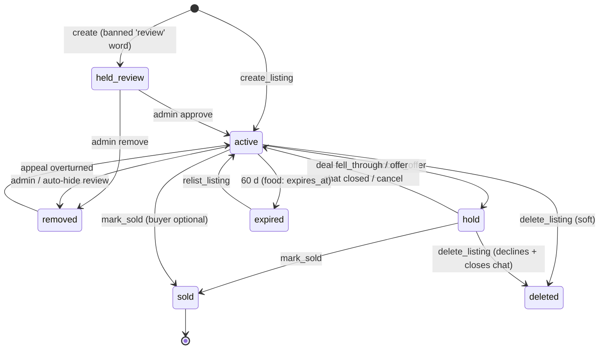
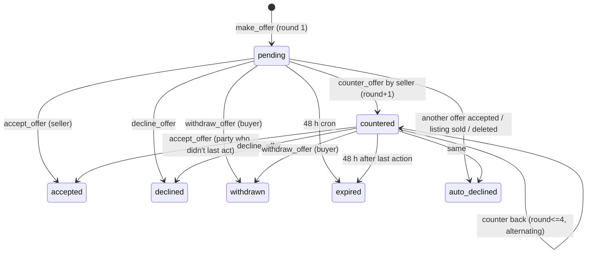
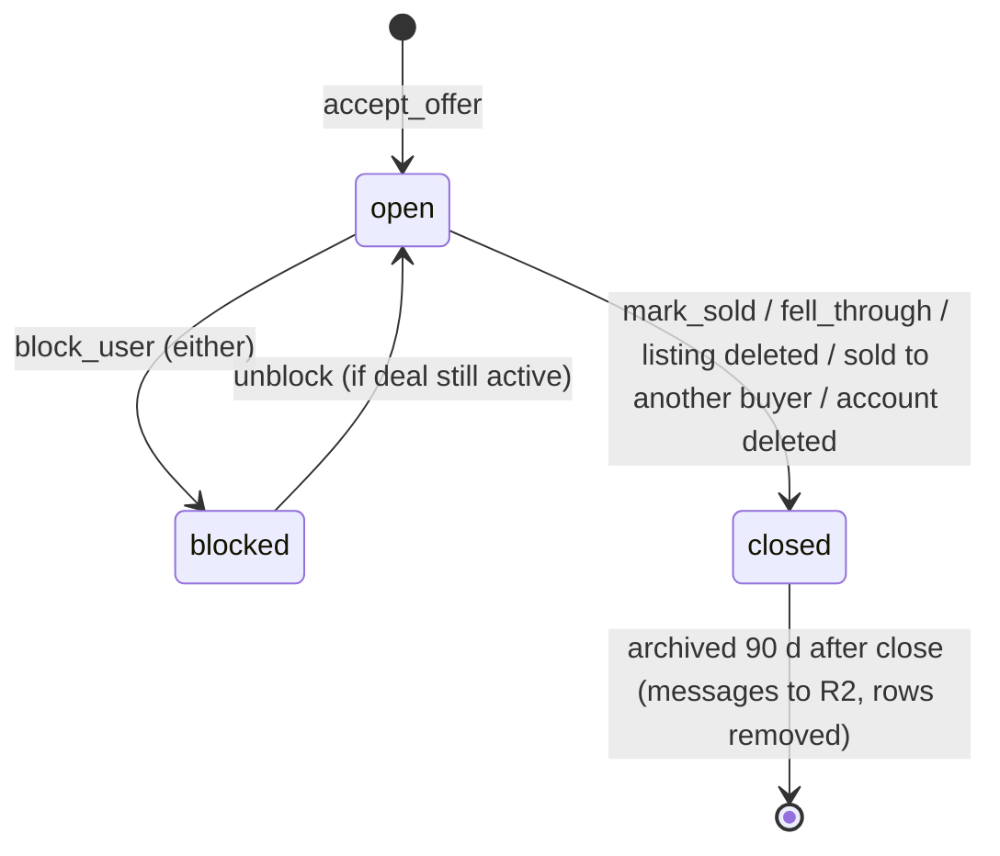
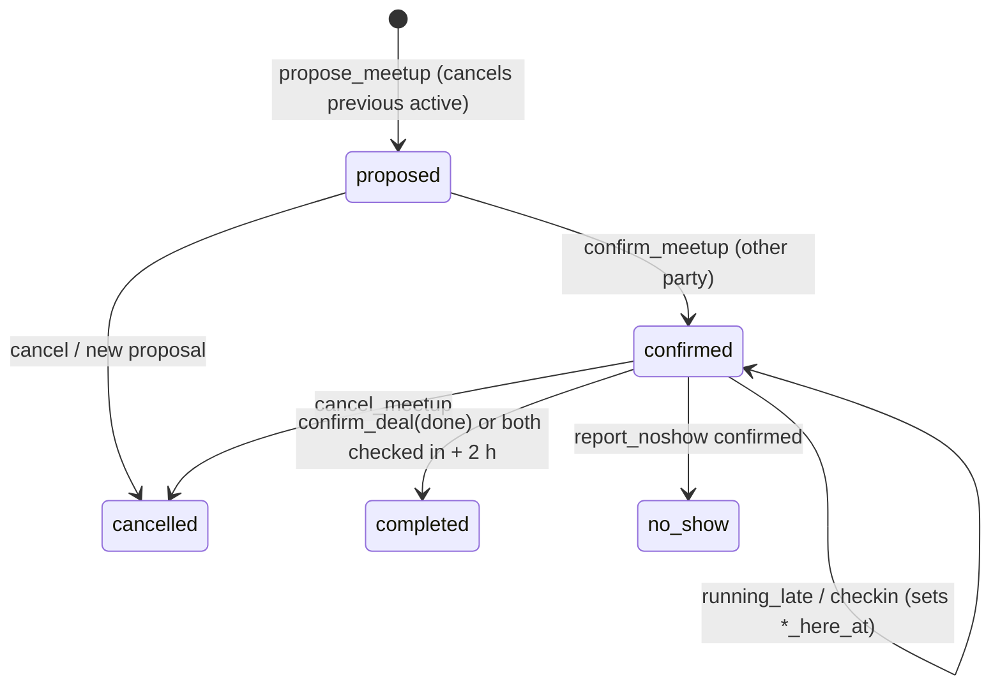

# DATA_MODEL.md — Schema, access rules, state machines (LOCKED)

**Database:** Supabase Postgres (Free tier, `us-east-1`).

**Migrations** are in `supabase/migrations/NNNN_*.sql`. They are forward-only and additive where possible (ARCHITECTURE ADR-011).

**Release tags:** **[R1.0]** is built for launch. **[R1.1]** ships in a later migration; it's listed here so R1.0 doesn't conflict with it.

## 0. Conventions

**Schemas:**

| Schema | Holds | Exposed through the API? |
|---|---|---|
| `public` | tables, views, RPCs (including `admin_*` RPCs) | Yes |
| `private` | helpers, peppers (read from Vault) | No |
| `extensions` | extensions | No |

**Types and naming:**

- IDs are `uuid default gen_random_uuid()`. High-volume append tables use `bigint generated always as identity`.
- Times are `timestamptz`. Money is `integer` cents.
- Time math uses `private.now()`, which wraps `now()` and can be overridden on staging only, and `campuses.timezone`.
- **Enums** are used for stable status sets. **`text + check`** is used for lists that change (reasons, notification types).

**Grants:**

- `revoke all on all tables in schema public from anon, authenticated`. Tables get only the grants listed per table.
- RPCs are granted to `authenticated` (and to `anon` for the public ones).
- `pg_graphql` is **disabled**.

**Rules:**

- **RLS is enabled on every table.** CI test T-SEC-19 fails if any table lacks it.
- **Write paths go through RPCs only.** Direct table INSERT/UPDATE/DELETE from clients is never granted, except the three column updates on `profiles` listed in §2.1.

**Roles referenced in policies:**

| Role | Meaning |
|---|---|
| `anon` | not signed in |
| self | `auth.uid() = row owner` |
| other user | authenticated, not the owner |
| participant | buyer or seller of the chat/offer |
| admin | `private.is_admin(min_role)`: `admins` row + JWT `aal='aal2'` |
| service | `service_role` (Edge Functions, cron) |

**JWT claims** are added by the custom access token hook: `campus_id`, `status`, `adult`, `admin_role`.

**Freshness rule (ADR-013).** Claims are used for reads. Every write RPC calls `private.require_active()`, which reads `profiles` live.

---

## 1. Extensions and enums — `0001_extensions_enums.sql` [R1.0]

```sql
create extension if not exists pg_trgm  with schema extensions;
create extension if not exists unaccent with schema extensions;
create extension if not exists pg_cron;
create extension if not exists pg_net;
create extension if not exists pgcrypto;
drop extension if exists pg_graphql;            -- BE-13

create type campus_status  as enum ('waitlist','live','paused');
create type user_status    as enum ('active','waitlist','reverify','paused','suspended','banned');
create type class_year     as enum ('freshman','sophomore','junior','senior','grad','other');
create type age_method     as enum ('os_signal','self_declared','review');
create type listing_kind   as enum ('sale','free','wanted','food');
create type listing_status as enum ('active','hold','sold','expired','held_review','removed','deleted');
create type item_condition as enum ('new','like_new','good','fair');
create type swipe_dir      as enum ('left','save');           -- right-swipe = offer (recorded as offer)
create type offer_status   as enum ('pending','countered','accepted','declined','expired','withdrawn','auto_declined');
create type chat_status    as enum ('open','closed','blocked');
create type message_kind   as enum ('text','system','meetup','photo');   -- 'photo' used from R1.1
create type meetup_status  as enum ('proposed','confirmed','cancelled','completed','no_show');
create type report_status  as enum ('open','actioned','dismissed');
create type admin_role     as enum ('owner','moderator');
create type push_state     as enum ('pending','sending','sent','skipped','failed');
create type spot_designation as enum ('public','police');
```

---

## 2. Tables

### 2.1 Campus and identity [R1.0]

```sql
create table campuses (
  id uuid primary key default gen_random_uuid(),
  slug text unique not null check (slug ~ '^[a-z0-9-]{2,40}$'),
  name text not null, short_name text not null,
  timezone text not null default 'America/New_York',
  status campus_status not null default 'waitlist',
  unlock_threshold int not null default 500,
  unlocked_at timestamptz,
  founding_seller_limit int not null default 50,
  offers_per_hour int not null default 10,
  noshow_pause_threshold int not null default 2,
  reverify_months int not null default 12,
  quad_enabled bool not null default false,          -- R1.1; needs >=300 active users (SEC-13)
  is_demo bool not null default false,
  created_at timestamptz not null default now()
);
-- RLS: authenticated select where id = claim campus_id; admin select all; writes via admin_update_campus.

create table campus_domains (
  domain text primary key check (domain = lower(domain)),
  campus_id uuid not null references campuses on delete cascade,
  kind text not null check (kind in ('student','blocked')),   -- aliases = extra 'student' rows (PM-03)
  created_at timestamptz not null default now()
);
-- RLS: no direct access (lookup_school only).

create table profiles (
  id uuid primary key references auth.users on delete cascade,
  campus_id uuid not null references campuses,
  email_hash text not null,
  status user_status not null default 'active',
  status_reason text, paused_until timestamptz,
  first_name text check (char_length(first_name) between 1 and 30),
  last_initial char(1),
  display_name text generated always as (first_name || coalesce(' ' || last_initial || '.', '')) stored,
  year class_year, areas text[] not null default '{}',
  bio text check (char_length(bio) <= 80),
  avatar_path text,
  verified_until date not null,
  adult_confirmed_at timestamptz, age_method age_method,
  rules_accepted_at timestamptz, rules_version text,
  invite_code text unique not null default private.new_invite_code(),
  invited_by uuid references profiles on delete set null,
  founding_seller_until timestamptz,
  theme_mode text not null default 'system' check (theme_mode in ('system','light','dark')),
  analytics_opt_in bool not null default true,
  crash_reports_opt_in bool not null default true,
  noshow_count int not null default 0,
  strike_count int not null default 0,
  seen_unlock_at timestamptz, last_active_at timestamptz,
  created_at timestamptz not null default now()
);
create index on profiles (campus_id, status);
create index on profiles (campus_id, created_at);
create index on profiles (verified_until);
-- RLS: self select; self update ONLY (theme_mode, analytics_opt_in, crash_reports_opt_in) via column grants;
--      others read public columns via view public_profiles (same campus, not blocked); admin select.

create table review_accounts (email text primary key, note text);              -- no access
create table age_blocks (email_hash text primary key, created_at timestamptz default now());   -- no access; purge 365 d
create table banned_hashes (email_hash text primary key, created_at timestamptz default now()); -- no access
create table waitlist_requests (
  id uuid primary key default gen_random_uuid(),
  email_hash text unique not null, email_enc bytea not null,   -- pgp_sym_encrypt, key in Vault
  domain text not null, school_guess text,
  created_at timestamptz default now(), notified_at timestamptz
);                                                         -- no access; purge 12 months
create table admins (
  user_id uuid primary key references profiles on delete cascade,
  role admin_role not null, campus_id uuid references campuses,   -- null = all
  invited_by uuid, created_at timestamptz default now()
);                                                         -- admin select; owner writes via RPC
create table app_config (key text primary key, value jsonb not null, updated_at timestamptz default now());
-- RLS: anon/auth select keys in ('maintenance','min_version_ios','min_version_android','rules_version',
--      'quad_enabled','chat_photos_enabled'); owner writes via admin_set_config.
create table activity_days (user_id uuid, day date, primary key (user_id, day));   -- no access; purge 400 d
create table common_first_names (name text primary key);                            -- no access (R1.1 Quad)
```

### 2.2 Listings [R1.0]

```sql
create table categories (id smallint primary key, slug text unique, name text, parent_id smallint references categories, sort smallint);
-- RLS: select for everyone. Rows come from migration 0100_ref_data.sql.

create table listings (
  id uuid primary key,                                   -- from reserve_listing_id (BE-05)
  campus_id uuid not null references campuses,
  seller_id uuid references profiles on delete cascade,  -- account deletion removes listing rows; chats keep snapshots
  kind listing_kind not null default 'sale',
  status listing_status not null default 'active',
  title text not null check (char_length(title) between 3 and 80),
  description text check (char_length(description) <= 1000),
  category_id smallint references categories,
  condition item_condition,
  price_cents int not null default 0 check (price_cents between 0 and 200000),
  open_to_offers bool not null default true,
  meet_spot_ids uuid[] not null default '{}',
  meet_note text check (char_length(meet_note) <= 60),
  availability text[] not null default '{}',
  wanted_max_cents int check (wanted_max_cents between 0 and 200000),
  wanted_ref uuid references listings on delete set null,        -- PM-05
  share_image_path text,
  view_count int not null default 0, save_count int not null default 0, offer_count int not null default 0,
  hold_offer_id uuid,
  buyer_id uuid references profiles on delete set null,
  sold_at timestamptz, sold_in_app bool,
  expires_at timestamptz,                                 -- food: <= 3 h; others: 60 d
  bumped_at timestamptz not null default now(),
  deleted_at timestamptz,
  search tsvector generated always as (
    setweight(to_tsvector('english', private.unaccent_immutable(title)),'A') ||
    setweight(to_tsvector('english', private.unaccent_immutable(coalesce(description,''))),'B')) stored,
  created_at timestamptz not null default now(), updated_at timestamptz not null default now()
);
create index on listings using gin (search);
create index on listings using gin (title gin_trgm_ops);
create index on listings (campus_id, status, bumped_at desc);
create index on listings (seller_id, status);
create index on listings (campus_id, kind, status, created_at desc);
create index on listings (expires_at) where status = 'active';
-- RLS select (authenticated, same campus): status in ('active','hold','sold') and not private.is_blocked(auth.uid(), seller_id)
--   OR seller_id = auth.uid() and status <> 'deleted'.  admin: all. No direct writes.

create table listing_photos (
  id uuid primary key default gen_random_uuid(),
  listing_id uuid not null references listings on delete cascade,
  idx smallint not null check (idx between 0 and 7),
  path text not null, thumb_path text not null, width int, height int, blurhash text,
  unique (listing_id, idx)
);  -- RLS: select if parent listing selectable.

create table listing_reservations (id uuid primary key, user_id uuid not null, created_at timestamptz default now(), used_at timestamptz);  -- no access; purge 24 h
create table listing_price_changes (id bigint generated always as identity primary key, listing_id uuid references listings on delete cascade, old_cents int, new_cents int, changed_at timestamptz default now()); -- no access
create table swipes (user_id uuid references profiles on delete cascade, listing_id uuid references listings on delete cascade, dir swipe_dir not null, created_at timestamptz default now(), primary key (user_id, listing_id));  -- self select; purge 30 d (non-save)
create index on swipes (listing_id);
create table saves (user_id uuid references profiles on delete cascade, listing_id uuid references listings on delete cascade, price_at_save int, created_at timestamptz default now(), primary key (user_id, listing_id));  -- self select
create index on saves (listing_id);
create table watches (user_id uuid references profiles on delete cascade, listing_id uuid references listings on delete cascade, created_at timestamptz default now(), primary key (user_id, listing_id));  -- self select
create table saved_searches (
  id uuid primary key default gen_random_uuid(),
  user_id uuid not null references profiles on delete cascade, campus_id uuid not null,
  query text check (char_length(query) <= 80),
  filters jsonb not null default '{}',   -- keys: category_ids int[], min_cents, max_cents, condition, free_only
  alerts bool not null default true,
  last_seen_at timestamptz default now(), last_notified_at timestamptz, created_at timestamptz default now()
);  -- self select; max 20/user (trigger)
```

### 2.3 Offers, chats, meetups, ratings [R1.0]

```sql
create table offers (
  id uuid primary key default gen_random_uuid(),
  listing_id uuid references listings on delete set null,          -- BE-01
  buyer_id uuid references profiles on delete set null,
  seller_id uuid references profiles on delete set null,
  amount_cents int not null check (amount_cents between 0 and 200000),
  note text check (char_length(note) <= 140), quick_notes text[] not null default '{}',
  status offer_status not null default 'pending',
  round smallint not null default 1 check (round between 1 and 4),
  last_actor text not null default 'buyer' check (last_actor in ('buyer','seller')),
  decline_reason text,
  expires_at timestamptz not null default now() + interval '48 hours',
  responded_at timestamptz, created_at timestamptz not null default now()
);
create unique index offers_one_open on offers (listing_id, buyer_id) where status in ('pending','countered');
create index on offers (seller_id, status); create index on offers (buyer_id, status);
create index on offers (expires_at) where status in ('pending','countered');
-- RLS select: auth.uid() in (buyer_id, seller_id). admin select.

create table chats (
  id uuid primary key default gen_random_uuid(),
  listing_id uuid references listings on delete set null,
  offer_id uuid unique references offers on delete set null,
  buyer_id uuid references profiles on delete set null,
  seller_id uuid references profiles on delete set null,
  listing_title text not null, listing_price_cents int not null, listing_thumb_path text,   -- snapshot (BE-01)
  agreed_cents int not null,
  status chat_status not null default 'open',
  last_message_at timestamptz not null default now(),
  buyer_read_at timestamptz, seller_read_at timestamptz,
  buyer_hidden bool not null default false, seller_hidden bool not null default false,
  buyer_muted bool not null default false, seller_muted bool not null default false,
  buyer_outcome text check (buyer_outcome in ('done','not_yet','fell_through')),
  seller_outcome text check (seller_outcome in ('done','not_yet','fell_through')),
  closed_at timestamptz, archived_at timestamptz, created_at timestamptz not null default now()
);
create index on chats (buyer_id, last_message_at desc); create index on chats (seller_id, last_message_at desc);
-- RLS select: participants. admin: only through admin_read_reported_chat.

create table messages (
  id bigint generated always as identity primary key,
  chat_id uuid not null references chats on delete cascade,
  sender_id uuid references profiles on delete set null,
  kind message_kind not null default 'text',
  body text check (char_length(body) <= 1000),
  photo_path text,                                   -- R1.1
  meta jsonb, client_id uuid,
  created_at timestamptz not null default now(),
  unique (chat_id, client_id)
);
create index on messages (chat_id, id desc);
-- RLS select: chat participants. Insert only via send_message.

create table safe_spots (    -- "Meetup spots" in UI copy (LEG-04)
  id uuid primary key default gen_random_uuid(),
  campus_id uuid not null references campuses on delete cascade,
  name text not null, description text, hours text,
  lat double precision not null, lng double precision not null,   -- used for Directions deep links
  designation spot_designation not null default 'public',
  designated_on date,                                               -- required when designation='police'
  is_default bool not null default false, active bool not null default true, sort smallint default 0,
  check (designation = 'public' or designated_on is not null)
);  -- RLS: same campus select where active; anon via public_safe_spots(slug); admin writes via RPC.

create table meetups (
  id uuid primary key default gen_random_uuid(),
  chat_id uuid not null references chats on delete cascade,
  spot_id uuid references safe_spots on delete set null,
  custom_place text check (char_length(custom_place) <= 60),
  starts_at timestamptz not null,
  status meetup_status not null default 'proposed',
  proposed_by uuid references profiles on delete set null, confirmed_at timestamptz,
  buyer_here_at timestamptz, seller_here_at timestamptz,
  late_user uuid, late_minutes smallint check (late_minutes in (5,10,15,30)),
  cancelled_by uuid, cancel_reason text, previous_starts_at timestamptz,
  reminder_sent_at timestamptz, deal_check_sent_at timestamptz,
  share_token text unique, share_created_by uuid, share_expires_at timestamptz,
  created_at timestamptz not null default now(),
  check (spot_id is not null or custom_place is not null)
);
create unique index meetups_one_active on meetups (chat_id) where status in ('proposed','confirmed');   -- BE-06
create index on meetups (starts_at) where status = 'confirmed';
-- RLS select: chat participants.

create table noshow_reports (
  id uuid primary key default gen_random_uuid(),
  meetup_id uuid not null references meetups on delete cascade,
  reporter_id uuid references profiles on delete set null,
  reported_id uuid references profiles on delete set null,
  note text check (char_length(note) <= 300),
  status text not null default 'open' check (status in ('open','confirmed','rejected')),
  created_at timestamptz not null default now(),
  unique (meetup_id, reporter_id)
);  -- RLS: reporter select own; admin all.

create table ratings (
  id uuid primary key default gen_random_uuid(),
  chat_id uuid not null references chats on delete cascade,
  rater_id uuid references profiles on delete set null,
  ratee_id uuid references profiles on delete set null,
  thumbs_up bool not null, tags text[] not null default '{}',
  comment text check (char_length(comment) <= 200),
  created_at timestamptz not null default now(),
  unique (chat_id, rater_id)
);  -- RLS: rater select own; everyone reads ratings_visible.

create table blocks (blocker_id uuid references profiles on delete cascade, blocked_id uuid references profiles on delete cascade, created_at timestamptz default now(), primary key (blocker_id, blocked_id));
-- RLS: blocker select own.
```

### 2.4 Safety and ops [R1.0]

```sql
create table reports (
  id uuid primary key default gen_random_uuid(),
  campus_id uuid not null,
  reporter_id uuid references profiles on delete set null,
  target_type text not null check (target_type in ('listing','user','chat','message','quad_post','quad_reply')),
  target_id text not null,
  target_user_id uuid references profiles on delete set null,     -- never returned to reporter
  reason text not null check (reason in ('scam','not_allowed','stolen','counterfeit','misleading','harassment','threat',
         'hate','sexual','minor_safety','calls_out_student','spam','self_harm','no_show','other')),
  details text check (char_length(details) <= 500),
  evidence jsonb not null default '{}',     -- BE-02: {text, excerpts[], photo_keys[], captured_at}
  status report_status not null default 'open',
  priority smallint not null default 2,     -- 1 = threat, self_harm, minor_safety
  assigned_to uuid, action_taken text, resolved_at timestamptz,
  created_at timestamptz not null default now()
);
create unique index reports_one_open on reports (reporter_id, target_type, target_id) where status = 'open';
create index on reports (campus_id, status, priority, created_at);
-- RLS: reporter reads via view my_reports (no target_user_id, no evidence); admin all.

create table strikes (id uuid primary key default gen_random_uuid(), user_id uuid references profiles on delete cascade, reason text, report_id uuid, created_by uuid, expires_at timestamptz default now() + interval '180 days', cleared_at timestamptz, created_at timestamptz default now());
create table appeals (
  id uuid primary key default gen_random_uuid(),
  user_id uuid not null references profiles on delete cascade,
  subject_type text not null check (subject_type in ('strike','listing','quad_post','suspension','noshow')),
  subject_id text not null,
  reason_choice text, body text check (char_length(body) <= 500),
  status text not null default 'open' check (status in ('open','upheld','overturned')),
  decided_by uuid, decision_note text, decided_at timestamptz, created_at timestamptz default now(),
  unique (subject_type, subject_id)
);
create table banned_words (
  id uuid primary key default gen_random_uuid(),
  pattern text not null, match text not null default 'word' check (match in ('word','phrase','regex')),
  scopes text[] not null, action text not null check (action in ('block','review')),
  fired_count int not null default 0, overturned_count int not null default 0,
  created_by uuid, created_at timestamptz default now()
);  -- no user access
create table audit_log (
  id bigint generated always as identity primary key,
  actor_id uuid, action text not null, target_type text, target_id text, campus_id uuid,
  reason text, case_ref text, meta jsonb, created_at timestamptz not null default now()
);  -- admin select; trigger forbids update/delete; retain 2 y
create unlogged table rate_counters (user_id uuid, action text, window_start timestamptz, count int not null, primary key (user_id, action, window_start));  -- BE-16
create table support_requests (id uuid primary key default gen_random_uuid(), email text, topic text check (topic in ('general','cant_access_email','safety','bug','other')), body text check (char_length(body) <= 2000), created_at timestamptz default now(), handled_at timestamptz);
create table daily_counters (campus_id uuid, day date, key text, value int not null default 0, primary key (campus_id, day, key));
```

### 2.5 Notifications and email [R1.0]

```sql
create table notifications (
  id bigint generated always as identity primary key,
  user_id uuid not null references profiles on delete cascade,
  type text not null,                              -- catalog in API.md §7 (check constraint lists R1.0 types)
  grp text not null check (grp in ('offers','messages','meetups','alerts','selling','safety','account','campus','quad')),
  title text not null, body text not null, data jsonb not null default '{}',
  time_sensitive bool not null default false,
  dedupe_key text,                                  -- BE-04
  push_state push_state not null default 'pending', push_after timestamptz not null default now(), claimed_at timestamptz,
  read_at timestamptz, created_at timestamptz not null default now()
);
create unique index notifications_dedupe on notifications (user_id, dedupe_key) where dedupe_key is not null;
create index on notifications (user_id, created_at desc);
create index on notifications (push_after) where push_state = 'pending';
-- RLS: self select. purge 60 d.

create table notification_prefs (
  user_id uuid primary key references profiles on delete cascade,
  offers bool not null default true, messages bool not null default true, meetups bool not null default true,
  saved_search bool not null default true, price_drop bool not null default true,
  free_food bool not null default false,
  tips bool not null default false,                 -- promotional (Apple 4.5.4): stale nudges, campus news
  quad_replies bool not null default false,         -- R1.1
  message_previews bool not null default false,
  quiet_start time not null default '23:00', quiet_end time not null default '08:00'
);
create table push_tokens (id uuid primary key default gen_random_uuid(), user_id uuid references profiles on delete cascade, token text unique not null, platform text check (platform in ('ios','android')), app_version text, created_at timestamptz default now(), last_seen_at timestamptz default now(), disabled_at timestamptz);
create table push_tickets (id bigint generated always as identity primary key, token_id uuid, notification_id bigint, ticket_id text, status text, error text, created_at timestamptz default now(), checked_at timestamptz);
create table email_outbox (
  id bigint generated always as identity primary key,
  to_email text not null,
  template text not null check (template in ('campus_open','account_paused','reverify_due','account_deleted','data_export','admin_reveal_receipt','support_request','priority_report')),
  vars jsonb not null default '{}', dedupe_key text unique,
  state text not null default 'pending' check (state in ('pending','sending','sent','failed')),
  send_after timestamptz not null default now(), claimed_at timestamptz, sent_at timestamptz, error text, attempts smallint not null default 0
);
create table announcements (id uuid primary key default gen_random_uuid(), campus_id uuid references campuses, type text check (type in ('safety','news','update')), title text check (char_length(title) <= 60), body text check (char_length(body) <= 200), send_push bool, created_by uuid, created_at timestamptz default now(), sent_at timestamptz, pinned_until timestamptz);  -- R1.1 UI; table in R1.0
create table data_exports (id uuid primary key default gen_random_uuid(), user_id uuid references profiles on delete cascade, status text, path text, expires_at timestamptz, created_at timestamptz default now());
```

### 2.6 Quad [R1.1] — separate migration `0200_quad.sql`

These tables are unchanged from `docs/archive/blueprint-v0/backend.md` §2.4 except:
- no `hot_rank` column (ranking is computed at read, BE-08)
- `quad_replies.alias_no` gives letter-color aliases (UX-11)
- no user select policies on posts, replies or hides (anonymity)

The tables are:
- `quad_posts(id, campus_id, author_id, kind text check in ('text','photo','poll'), body ≤500, photo_path, score, reply_count, status text check in ('live','held','hidden','removed'), hold_reason, replies_enabled, created_at)`
- `quad_replies(id, post_id, author_id, body ≤300, alias_no, score, status, created_at)`
- `quad_votes(user_id, target_type, target_id, value ±1, pk)`
- `quad_poll_options(id, post_id, label ≤40, idx, votes)`
- `quad_poll_votes(post_id, user_id, option_id, pk(post_id,user_id))`
- `quad_hides(user_id, hidden_author_id, source_post_id, pk)`
- `quad_mutes(user_id, keyword, pk)`

### 2.7 Views [R1.0]

| View | Definition / use |
|---|---|
| `public_profiles` | `id, display_name, year, avatar_path, created_at, founding_seller_until` for the same campus, not blocked (security invoker) |
| `profile_stats` (materialized, unique index on `user_id`, refreshed every 10 min, concurrently) | `swaps_count`, `thumbs_up`, `thumbs_total`, `median_reply_minutes`, `active_listings` |
| `ratings_visible` | ratings where both sides rated or the rating is older than 7 days; rater shown as "Deleted user" when null |
| `campus_progress` | `members`, `threshold`, `founding_left`, `status` |
| `price_hints` (materialized, daily) | p25/p50/p75 per campus and category over the last 180 d sold; hidden if n < 5 |
| `campus_trending_terms` (materialized, hourly) | top 8 title terms from the most-saved listings over 7 d |
| `my_reports` | reporter's reports without `target_user_id` or `evidence` |
| `admin_metrics_*` | funnel, retention (from `activity_days`), liquidity, safety (DATA-01 definitions in PRD §5) |

---

## 3. Access rules matrix [R1.0]

S = select, W = write. "via RPC" means the only write path is a security-definer function.

| Table | anon | self | other user (same campus) | participant | admin (aal2) | service |
|---|---|---|---|---|---|---|
| campuses | via `public_campus_progress` | S own campus | S | — | S; W via RPC | all |
| campus_domains | via `lookup_school` | — | — | — | S; W via RPC | all |
| profiles | — | S; W 3 columns | S via `public_profiles` | — | S; W via RPC | all |
| listings / listing_photos | via `get_listing_public_card` | S all statuses except deleted | S active/hold/sold, not blocked | — | S; W via RPC | all |
| swipes / saves / watches / saved_searches | — | S; W via RPC | — | — | S | all |
| offers | — | — | — | S | S | all |
| chats / messages / meetups | via `get_meetup_share(token)` | — | — | S; W via RPC | only via `admin_read_reported_chat` | all |
| ratings | — | S own given | via `ratings_visible` | — | S | all |
| blocks | — | S own | — | — | S | all |
| reports | — | via `my_reports` | — | — | S; W via RPC | all |
| strikes / appeals | — | S own; appeal W via RPC | — | — | S; W via RPC | all |
| notifications / prefs / push_tokens / data_exports | — | S; W via RPC | — | — | — | all |
| safe_spots | via `public_safe_spots` | — | S active | — | S; W via RPC | all |
| app_config | S public keys | S public keys | — | — | S; owner W via RPC | all |
| audit_log | — | — | — | — | S (insert only via RPCs; no update/delete for anyone) | insert |
| all other support tables | — | — | — | — | — | all |
| `realtime.messages` | — | topic `user:{uid}` | — | topic `chat:{id}` | — | — |

---

## 4. State machines

### 4.1 Listing



**Invariants:**
- `hold ⇒ hold_offer_id is not null` and that offer is `accepted`.
- `sold ⇒ sold_at is not null`.
- At most one accepted offer per listing at a time.
- A `deleted` listing is never visible to others. Its chats keep snapshots and become read-only with the system message "The seller removed this listing".

### 4.2 Offer



**Rules:**
- One open offer per (listing, buyer).
- `make_offer` locks the listing `FOR SHARE` and requires it to be `active` and `open_to_offers` (BE-10).
- `accept_offer` locks the listing `FOR UPDATE` and flips it to `hold` (race-safe; T-INT-OFF-RACE).
- Free items use `amount_cents = 0` with the copy "Ask for it" (PM-06).

### 4.3 Chat



**Rules:**
- A closed chat is read-only.
- Blocked means neither side can send, and the composer shows the blocked state.
- A deleted counterpart shows as "Deleted user".

### 4.4 Meetup



**No-show rules (BE-07):**
- The reporter must have checked in.
- It's allowed from start + 20 min.
- It's rejected if the other side also checked in.
- It's auto-confirmed after 24 h if the reported user doesn't dispute. Disputes go through an appeal (`subject_type='noshow'`).
- Two confirmed no-shows pause offers.

### 4.5 Report and appeal

- **Report:** `open` → `actioned` or `dismissed`.
  - Auto-hide happens at 3 distinct reporters older than 7 days within 24 h. It sets the target to `held_review`/`hidden` but keeps the report `open`.
  - Priority-1 reasons email the owner immediately.
- **Appeal:** `open` → `upheld` or `overturned`. There's one per subject.

### 4.6 Account status

| Status | Enters when | Leaves when | App shows | Allowed |
|---|---|---|---|---|
| `waitlist` | campus not live | campus goes live | A13 | read campus progress, invite |
| `active` | — | — | app | everything |
| `reverify` | `verified_until` < today | `complete_reverify` | X9 | nothing but re-verify |
| `paused` | 2 no-shows or 1st strike (auto, 7 d max) | `paused_until` passes (cron) | X10 | read, finish open chats |
| `suspended` | admin (moderator ≤ 7 d) | admin, or `paused_until` passes | X10 | read, finish open chats |
| `banned` | admin (owner only) | appeal overturned | X10 banned | appeal only; `banned_hashes` stored on deletion |

Suspensions and bans revoke sessions (ADR-013).

### 4.7 Campus

`waitlist` → `live`:
- For new campuses, this happens automatically at `unlock_threshold`.
- For the launch campus, the admin flips it (DEC-11).

`live` ↔ `paused` is set by the admin.

---

## 5. Retention (must match the Privacy policy, LEG-07)

| Data | Retention |
|---|---|
| Account, listings, messages | until account deletion. Closed chats archived to R2 after 90 d; archives deleted on account deletion |
| Notifications | 60 d |
| Swipes (non-save) | 30 d |
| Reports + evidence | 180 d after resolution (reporter nulled on deletion) |
| Audit log | 2 years |
| Age blocks (hash only) | 365 d |
| Banned hashes | indefinite (hash only) |
| Waitlist requests (encrypted email) | until notified or 12 months |
| Data exports | 7 d link; object deleted day 8 |
| Backups | 30 d |
| Rate counters | 2 d |
| Activity days | 400 d |

---

## 6. Storage (Cloudflare R2) [R1.0]

**Buckets** (and their `-staging` twins):

| Bucket | Access | Contents |
|---|---|---|
| `onlyswap-media` | public read through the media Worker, prefix allowlist | `c/{campus}/l/{listing}/{uuid}_{full\|thumb}.webp`, `c/{campus}/u/{user}/avatar_{uuid}.webp`, `share/{listing}.jpg`; R1.1: `c/{campus}/chat/{chat}/…` (signed reads), `c/{campus}/quad/{post}/…` |
| `onlyswap-private` | presigned GET only | `exports/{uid}/{id}.json` (lifecycle 8 d), `evidence/{report}/…` (lifecycle 200 d), `archive/chats/{chat}.json` |
| `onlyswap-backups` | GitHub Actions only | `db/{date}.sql.age` (lifecycle 30 d) |

**Limits** (enforced by signed `content-length` + `content-type`, SEC-02):

| Object | Size | Type |
|---|---|---|
| Full photo | 2 MB | `image/webp` |
| Thumbnail | 200 KB | `image/webp` |
| Avatar | 300 KB | `image/webp` |
| Share card | 500 KB | `image/jpeg` |

**Processing** happens on the client:
- resize (1080 / 400 / 512)
- WebP q 0.72
- EXIF stripped by re-encode (tested)
- blurhash

**Cleanup:** draft objects without a listing row older than 24 h are deleted daily; sold listings older than 180 d keep the thumbnail only.

---

## 7. Migrations plan

| File | Contents | Release |
|---|---|---|
| `0001_extensions_enums.sql` | §1 | R1.0 |
| `0002_campus_identity.sql` | §2.1 | R1.0 |
| `0003_listings.sql` | §2.2 | R1.0 |
| `0004_deals.sql` | §2.3 | R1.0 |
| `0005_safety_ops.sql` | §2.4 | R1.0 |
| `0006_notifications.sql` | §2.5 | R1.0 |
| `0007_helpers.sql` | `private.*` (API.md §1) | R1.0 |
| `0008_rls_grants.sql` | §3 + revokes | R1.0 |
| `0009_views.sql` | §2.7 | R1.0 |
| `0010_hooks_triggers.sql` | API.md §2 | R1.0 |
| `0011_rpcs_*.sql` | API.md §3 by domain | R1.0 |
| `0090_cron.sql` | API.md §6 | R1.0 |
| `0100_ref_data.sql` | categories, banned words (+ pets, gift cards, recalled items), `app_config` defaults: idempotent upserts (BE-15) | R1.0 |
| `0200_quad.sql` … | R1.1 features | R1.1 |

Staging-only objects (`test_set_now`, the `private.now()` override, the `test_otps` table) live in `supabase/migrations_staging/` and are **never** applied to production; a CI check enforces this.

Local demo data lives in `supabase/seed.sql`. It has Ohio State, Demo University, a waitlist campus, 40 demo listings, and fixtures users A/B/C/D.
